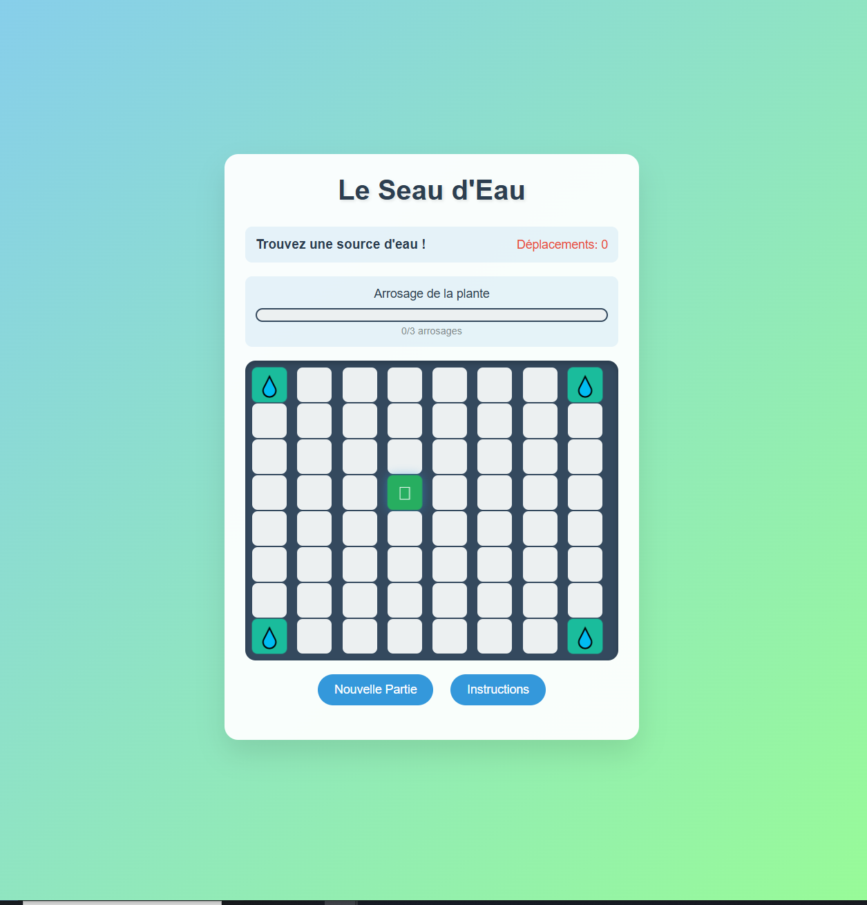

Le Seau d’Eau

**Mini-jeu développé en HTML, CSS et JavaScript.**

**Objectif du jeu :**  
Incarner un seau vide, trouver une source d’eau, puis arroser la plante au centre du plateau.  
Des cases bloquées apparaissent aléatoirement, ajoutant du défi et de la stratégie à chaque partie.

## Fonctionnalités
- Déplacements dans les 8 directions (vertical, horizontal, diagonal)  
- Cases bloquées générées aléatoirement  
- Gestion du DOM pour mettre à jour le plateau et les états du joueur  
- Interface simple et animations légères en CSS  

## Technologies
- **HTML5**
- **CSS3**
- **JavaScript**

## Aperçu

## Auteur
Développé par **Annie Litoiu** dans le cadre d’un projet personnel de pratique du JavaScript.  

---

Ce projet illustre la logique de jeu, la gestion d’événements et la manipulation du DOM côté client.
